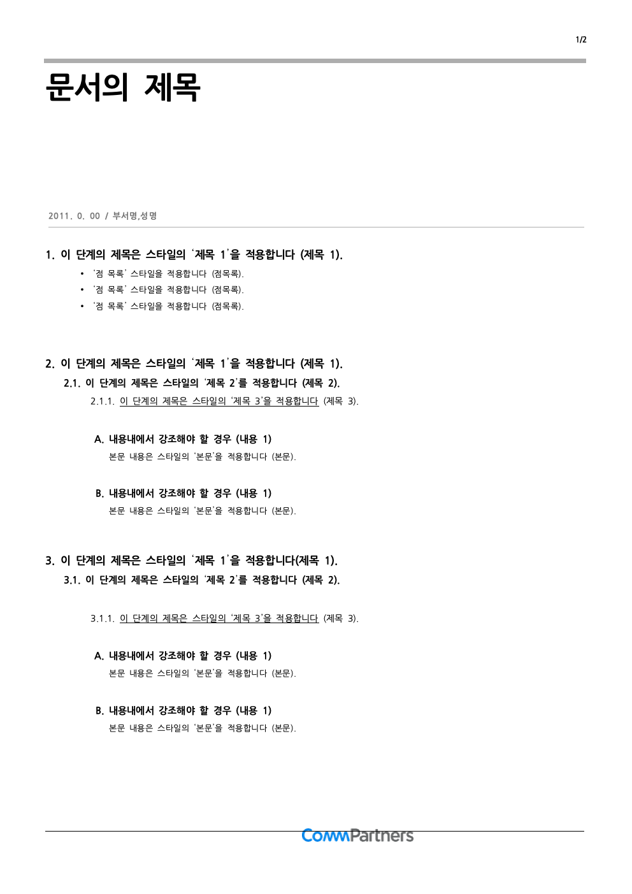
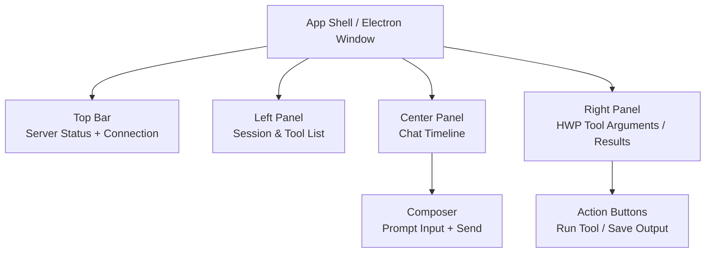

# HWPX-MCP

**[English](README.md) | [한국어](README.kr.md)**

A Model Context Protocol (MCP) server for creating and editing HWP/HWPX documents. This server provides AI assistants (like Claude, Cursor) with the ability to programmatically create, edit, and manipulate Hangul (Korean word processor) documents.

## Features

- **Cross-Platform Support**: Works on Windows (via COM Automation) and macOS/Linux (via python-hwpx)
- **120+ MCP Tools**: Comprehensive set of tools for document manipulation
- **Template Support**: Create documents from templates with field substitution
- **Chart Creation**: Insert and configure charts in documents
- **Equation Support**: Insert mathematical equations (LaTeX/Script)
- **Table Operations**: Full table manipulation (create, edit, format)
- **Formatting Control**: Character and paragraph formatting
- **Remote MCP Server**: Deploy as HTTP/SSE server via Docker
- **Agentic Gateway (Phase 1)**: Deterministic Tool-RAG routing gateway to reduce exposed tool surface

## Agentic Gateway (Phase 1)

The gateway exposes a smaller MCP tool surface (`tool_search`, `tool_describe`,
`tool_call`, `route_and_call`) while internally routing to existing backend tools.

Run gateway (stdio):

```bash
hwpx-mcp-gateway
```

Run offline routing eval (no paid LLM keys):

```bash
hwpx-mcp-eval --queries hwpx_mcp/eval/queries.jsonl --top-k 5
```

## Docker Deployment (Remote MCP Server)

Deploy hwpx-mcp as a remote MCP server accessible over HTTP.

### Quick Start with Docker

```bash
# Build the image
docker build -t hwpx-mcp .

# Run with HTTP transport
docker run -d -p 8000:8000 --name hwpx-mcp hwpx-mcp

# Or use docker-compose
docker-compose up -d
```

### Environment Variables

| Variable | Default | Description |
|----------|---------|-------------|
| `MCP_TRANSPORT` | `stdio` | Transport type: `stdio`, `http`, `sse`, `streamable-http` |
| `MCP_HOST` | `0.0.0.0` | Host to bind (for HTTP transports) |
| `MCP_PORT` | `8000` | Port to bind (for HTTP transports) |
| `MCP_PATH` | `/mcp` | URL path for MCP endpoint |
| `MCP_STATELESS` | `false` | Enable stateless HTTP mode |

### Connect MCP Clients to Remote Server

<details>
<summary><b>Claude Desktop - Remote HTTP</b></summary>

```json
{
  "mcpServers": {
    "hwpx-mcp": {
      "url": "http://your-server:8000/mcp",
      "transport": "streamable-http"
    }
  }
}
```

</details>

<details>
<summary><b>OpenCode - Remote HTTP</b></summary>

```jsonc
{
  "mcp": {
    "hwpx-mcp": {
      "type": "remote",
      "url": "http://your-server:8000/mcp",
      "transport": "http-stream",
      "enabled": true
    }
  }
}
```

</details>

### Limitations (Docker/Linux)

When running in Docker (Linux container), the following features are **not available**:
- Windows COM automation (pywin32)
- Editing existing HWP files
- Full HWP SDK features

Available features in Docker:
- HWPX file creation (via python-hwpx)
- HWP file reading (via pyhwp)
- All cross-platform tools

## Quick Start (Copy & Paste)

### 1. Install

<details>
<summary><b>Using uv (recommended)</b></summary>

```bash
git clone https://github.com/Topabaem05/hwpx-mcp.git
cd hwpx-mcp && uv pip install -e .
```

</details>

<details>
<summary><b>Using Anaconda/Conda</b></summary>

```bash
git clone https://github.com/Topabaem05/hwpx-mcp.git
cd hwpx-mcp
conda create -n hwpx-mcp python=3.11 -y
conda activate hwpx-mcp
pip install -e .
```

</details>

### 2. Get Your Install Path

Run this in the `hwpx-mcp` directory to copy the path:

```bash
# macOS/Linux
pwd | pbcopy  # macOS (copies to clipboard)
pwd           # Linux (copy manually)

# Windows (PowerShell)
(Get-Location).Path | clip
```

**For Anaconda users**, also get your Python path:

```bash
# macOS/Linux
which python | pbcopy  # After: conda activate hwpx-mcp

# Windows (PowerShell)
(Get-Command python).Source | clip
```

### 3. Configure Your MCP Client

Use the path from step 2 in the config below:

<details>
<summary><b>Claude Desktop (macOS) - uv</b></summary>

Edit `~/Library/Application Support/Claude/claude_desktop_config.json`:

```json
{
  "mcpServers": {
    "hwpx-mcp": {
      "command": "uv",
      "args": ["--directory", "/PASTE/YOUR/PATH/HERE", "run", "hwpx-mcp"]
    }
  }
}
```

</details>

<details>
<summary><b>Claude Desktop (macOS) - Anaconda</b></summary>

Edit `~/Library/Application Support/Claude/claude_desktop_config.json`:

```json
{
  "mcpServers": {
    "hwpx-mcp": {
      "command": "/PASTE/YOUR/CONDA/PYTHON/PATH/HERE",
      "args": ["-m", "hwpx_mcp.server"],
      "cwd": "/PASTE/YOUR/HWPX-MCP/PATH/HERE"
    }
  }
}
```

> Example paths:
> - Python: `/Users/username/anaconda3/envs/hwpx-mcp/bin/python`
> - cwd: `/Users/username/projects/hwpx-mcp`

</details>

<details>
<summary><b>Claude Desktop (Windows) - uv</b></summary>

Edit `%APPDATA%\Claude\claude_desktop_config.json`:

```json
{
  "mcpServers": {
    "hwpx-mcp": {
      "command": "cmd",
      "args": ["/c", "uv --directory C:\\PASTE\\YOUR\\PATH\\HERE run hwpx-mcp"]
    }
  }
}
```

</details>

<details>
<summary><b>Claude Desktop (Windows) - Anaconda</b></summary>

Edit `%APPDATA%\Claude\claude_desktop_config.json`:

```json
{
  "mcpServers": {
    "hwpx-mcp": {
      "command": "C:\\PASTE\\YOUR\\CONDA\\PYTHON\\PATH\\HERE\\python.exe",
      "args": ["-m", "hwpx_mcp.server"],
      "cwd": "C:\\PASTE\\YOUR\\HWPX-MCP\\PATH\\HERE"
    }
  }
}
```

> Example paths:
> - Python: `C:\Users\username\anaconda3\envs\hwpx-mcp\python.exe`
> - cwd: `C:\Users\username\projects\hwpx-mcp`

</details>

<details>
<summary><b>Claude Desktop (Linux) - uv</b></summary>

Edit `~/.config/Claude/claude_desktop_config.json`:

```json
{
  "mcpServers": {
    "hwpx-mcp": {
      "command": "uv",
      "args": ["--directory", "/PASTE/YOUR/PATH/HERE", "run", "hwpx-mcp"]
    }
  }
}
```

</details>

<details>
<summary><b>Claude Desktop (Linux) - Anaconda</b></summary>

Edit `~/.config/Claude/claude_desktop_config.json`:

```json
{
  "mcpServers": {
    "hwpx-mcp": {
      "command": "/PASTE/YOUR/CONDA/PYTHON/PATH/HERE",
      "args": ["-m", "hwpx_mcp.server"],
      "cwd": "/PASTE/YOUR/HWPX-MCP/PATH/HERE"
    }
  }
}
```

> Example paths:
> - Python: `/home/username/anaconda3/envs/hwpx-mcp/bin/python`
> - cwd: `/home/username/projects/hwpx-mcp`

</details>

<details>
<summary><b>Cursor - uv</b></summary>

Edit `~/.cursor/mcp.json` (macOS/Linux) or `%USERPROFILE%\.cursor\mcp.json` (Windows):

```json
{
  "mcpServers": {
    "hwpx-mcp": {
      "command": "uv",
      "args": ["--directory", "/PASTE/YOUR/PATH/HERE", "run", "hwpx-mcp"]
    }
  }
}
```

</details>

<details>
<summary><b>Cursor - Anaconda</b></summary>

Edit `~/.cursor/mcp.json` (macOS/Linux) or `%USERPROFILE%\.cursor\mcp.json` (Windows):

```json
{
  "mcpServers": {
    "hwpx-mcp": {
      "command": "/PASTE/YOUR/CONDA/PYTHON/PATH/HERE",
      "args": ["-m", "hwpx_mcp.server"],
      "cwd": "/PASTE/YOUR/HWPX-MCP/PATH/HERE"
    }
  }
}
```

</details>

<details>
<summary><b>VS Code (Copilot) - uv</b></summary>

Add to your VS Code `settings.json`:

```json
{
  "mcp": {
    "servers": {
      "hwpx-mcp": {
        "command": "uv",
        "args": ["--directory", "/PASTE/YOUR/PATH/HERE", "run", "hwpx-mcp"]
      }
    }
  }
}
```

</details>

<details>
<summary><b>VS Code (Copilot) - Anaconda</b></summary>

Add to your VS Code `settings.json`:

```json
{
  "mcp": {
    "servers": {
      "hwpx-mcp": {
        "command": "/PASTE/YOUR/CONDA/PYTHON/PATH/HERE",
        "args": ["-m", "hwpx_mcp.server"],
        "cwd": "/PASTE/YOUR/HWPX-MCP/PATH/HERE"
      }
    }
  }
}
```

</details>

<details>
<summary><b>OpenCode - uv</b></summary>

Create or edit `opencode.json` in your project root (or `~/.config/opencode/opencode.json` for global config):

```jsonc
{
  "$schema": "https://opencode.ai/config.json",
  "mcp": {
    "hwpx-mcp": {
      "type": "local",
      "command": ["uv", "--directory", "/PASTE/YOUR/PATH/HERE", "run", "hwpx-mcp"],
      "enabled": true
    }
  }
}
```

</details>

<details>
<summary><b>OpenCode - Anaconda</b></summary>

Create or edit `opencode.json` in your project root (or `~/.config/opencode/opencode.json` for global config):

```jsonc
{
  "$schema": "https://opencode.ai/config.json",
  "mcp": {
    "hwpx-mcp": {
      "type": "local",
      "command": ["/PASTE/YOUR/CONDA/PYTHON/PATH/HERE", "-m", "hwpx_mcp.server"],
      "enabled": true,
      "environment": {
        "PYTHONPATH": "/PASTE/YOUR/HWPX-MCP/PATH/HERE"
      }
    }
  }
}
```

> Example paths:
> - Python: `/Users/username/anaconda3/envs/hwpx-mcp/bin/python` (macOS/Linux)
> - Python: `C:\\Users\\username\\anaconda3\\envs\\hwpx-mcp\\python.exe` (Windows)
> - PYTHONPATH: `/Users/username/projects/hwpx-mcp`

</details>

### 4. Restart your MCP client and start using HWP tools!

## Electron UI (Open WebUI-inspired)

This repository now includes a minimal Electron UI shell modeled after the layout style of Open WebUI. It is a lightweight interface for:

- Session-style workspace layout
- Quick gateway endpoint check
- Open WebUI launch shortcut

### Run the Electron shell

```bash
cd /path/to/hwpx-mcp/electron-ui
export OPEN_WEBUI_URL=http://localhost:3000
# Streamable HTTP transport is required for the Electron UI
export MCP_TRANSPORT=streamable-http
export HWPX_MCP_HTTP_URL=http://127.0.0.1:8000/mcp
npm start
```

For a one-command local bootstrap (backend + Electron stack):

```bash
cd /path/to/hwpx-mcp/electron-ui
npm run start-stack
```

If you use Bun, run this one-command Bun flow to install backend deps and use `bunx npm install`:

```bash
cd /path/to/hwpx-mcp
./scripts/quick-start-bunx.sh
```

On Windows:

```powershell
cd C:\path\to\hwpx-mcp
./scripts/quick-start-bunx.ps1
```

Requirements for these Bun launchers:

- `bunx` command must be available (install Bun first: https://bun.sh/)
- shell environment must match platform: bash-compatible shell for `.sh`, PowerShell for `.ps1`
- if Bun is not installed, the launcher exits immediately with installation guidance

On Linux or container environments without Electron sandbox support, add:

```bash
HWPX_ELECTRON_NO_SANDBOX=1 npm run start-stack
```

If you want startup to fail fast instead of installing dependencies automatically, set:

```bash
HWPX_ELECTRON_AUTO_INSTALL=0 npm run start-stack
```

The bootstrap script:

- launches the backend (defaults to `uv run hwpx-mcp`) with streamable HTTP
- you can override the backend launcher with `HWPX_MCP_BACKEND_COMMAND`
- if `uv` is not installed, `start-stack` falls back to `python3 -m hwpx_mcp.server`
- waits until `/mcp` responds (or `/mcp/` equivalent redirect/404 behavior from streamable mount is observed)
- auto-installs Electron UI dependencies (`npm install`, or `bunx npm install` when npm is not available and bunx is installed)
- starts Electron
- tears down both processes together on exit

Open WebUI is optional and can be omitted. Configure `HWPX_MCP_HTTP_URL` for your running MCP streamable endpoint.

### Windows Quick Start (UI + MCP)

This flow is intended for Windows and uses two terminals:

1. Start MCP server with streamable transport.

```bat
:: Terminal 1
cd /d C:\path\to\hwpx-mcp
set MCP_TRANSPORT=streamable-http
set MCP_HOST=127.0.0.1
set MCP_PORT=8000
set MCP_PATH=/mcp
uv run hwpx-mcp
rem if uv is not available:
python3 -m hwpx_mcp.server
```

```powershell
# Terminal 1
Set-Location C:\path\to\hwpx-mcp
$env:MCP_TRANSPORT = "streamable-http"
$env:MCP_HOST = "127.0.0.1"
$env:MCP_PORT = "8000"
$env:MCP_PATH = "/mcp"
uv run hwpx-mcp
# if uv is not available:
python -m hwpx_mcp.server
```

2. Start Electron UI and point it at the MCP endpoint.

```bat
:: Terminal 2
cd /d C:\path\to\hwpx-mcp\electron-ui
set OPEN_WEBUI_URL=http://localhost:3000
set HWPX_MCP_HTTP_URL=http://127.0.0.1:8000/mcp
npm start
```

```powershell
# Terminal 2
Set-Location C:\path\to\hwpx-mcp\electron-ui
npm install
$env:OPEN_WEBUI_URL = "http://localhost:3000"
$env:HWPX_MCP_HTTP_URL = "http://127.0.0.1:8000/mcp"
npm start
```

Optional agentic gateway (stdio; separate process for agent workflows):

```bat
:: Terminal 3
cd /d C:\path\to\hwpx-mcp
set MCP_TRANSPORT=stdio
hwpx-mcp-gateway
```

```powershell
# Terminal 3
Set-Location C:\path\to\hwpx-mcp
$env:MCP_TRANSPORT = "stdio"
hwpx-mcp-gateway
```

### One-command Windows starter

From repository root:

```bat
rem Optional: force package manager for Electron dependency install (npm or bunx)
set HWPX_ELECTRON_PKG_MANAGER=npm
start-stack-windows.bat
```

```bat
:: Or force bunx
set HWPX_ELECTRON_PKG_MANAGER=bunx
start-stack-windows.bat
```

```powershell
# Optional: force package manager for Electron dependency install (npm or bunx)
$env:HWPX_ELECTRON_PKG_MANAGER = "npm"
./start-stack-windows.ps1
./start-stack-windows.ps1 -RunAgent   # also starts gateway terminal
```

```powershell
# Or force bunx
$env:HWPX_ELECTRON_PKG_MANAGER = "bunx"
./start-stack-windows.ps1
```

`start-stack-windows.bat` and `start-stack-windows.ps1` also auto-resolve the backend launcher:
- if `HWPX_MCP_BACKEND_COMMAND` is set, they use that command
- if `HWPX_MCP_BACKEND_EXE` is set, it takes precedence as a direct executable path (absolute or relative to repository root)
- otherwise they default to `uv run hwpx-mcp`, then fall back to `python3 -m hwpx_mcp.server` (or `python -m hwpx_mcp.server`) when `uv` is missing
- Set `HWPX_MCP_START_BACKEND=0` to skip backend launch in these scripts when you already run MCP elsewhere.

You can also launch from Electron UI with the same one-command bootstrap:

```powershell
cd /d C:\path\to\hwpx-mcp\electron-ui
npm run start-stack
```

Set `HWPX_MCP_START_BACKEND=0` to open only the UI.

Prerequisite notes:

- Install Python dependencies first (`uv pip install -e .` or `pip install -e .`).
- Install Node dependencies for Electron by running `npm install` inside `electron-ui` once, or let `npm run start-stack` install them automatically on first run (`npm install` or `bunx npm install`).
- If needed, set `HWPX_ELECTRON_PKG_MANAGER` to `npm` or `bunx` before first launch to force which installer is used.
- Hancom HWP (Windows COM features) must be installed for full Windows feature parity.

### Distribution Strategy

Use `DISTRIBUTION_PRD.md` for the cross-platform delivery plan. It defines:

- **Track A (current baseline):** `npm run start-stack` (or `start-stack-windows.*`) as the one-command local bootstrap; this path still requires Python runtime availability and backend install (`uv pip install -e .` or `pip install -e .`).
- **Track B (packaged installer):** Electron installer flow (`npm run build:win`) and a future backend-bundling strategy to reduce manual setup for end users.
- Hard constraint separation: Electron/UI path uses streamable HTTP, while the agentic gateway path is separate and stdio-only (`hwpx-mcp-gateway`).

For a Windows-specific rollout, implementation sequence and risk notes, see `WINDOWS_DISTRIBUTION_PRD.md`.

### Quick Troubleshooting

- `HWPX_MCP_BACKEND_EXE` is set but not found: verify the path is absolute or valid relative to repo root, and point it to an executable binary.
- `uv is not found`: install `uv`, or set `HWPX_MCP_BACKEND_COMMAND` to a local launcher command.
- Port already in use: pick another `MCP_PORT` before starting.
- UI cannot connect but backend is running: confirm `MCP_TRANSPORT=streamable-http` and `HWPX_MCP_HTTP_URL` point to the same endpoint. Streamable mount can return `307` on `/mcp` and `404` on `/mcp/` depending on server behavior.
- Hancom HWP feature limitations: expected without Windows COM components.
- `electron` exits with SIGTRAP during launch: set `HWPX_ELECTRON_NO_SANDBOX=1` for non-sandbox environments (typically Linux CI/headless).
- If `npm install` is unavailable, set `HWPX_ELECTRON_PKG_MANAGER=bunx` to use `bunx npm install` for Electron dependency install.

## Tool Reference

### 1. Document Management
| Tool | Description | Platform |
|------|-------------|----------|
| `hwp_connect` | Connect to HWP controller (auto-selects Windows COM or cross-platform) | All |
| `hwp_create` | Create a new HWP document | All |
| `hwp_open` | Open an existing HWP/HWPX document | All |
| `hwp_save` | Save the current document | All |
| `hwp_save_as` | Save document in specified format (hwp, hwpx, pdf) | All |
| `hwp_close` | Close the current document | All |
| `hwp_disconnect` | Disconnect from HWP controller | All |
| `hwp_set_edit_mode` | Set document mode (edit, readonly, form) | Windows |

### 2. Text & Formatting
| Tool | Description | Platform |
|------|-------------|----------|
| `hwp_insert_text` | Insert text at current cursor position | All |
| `hwp_get_text` | Get all text from the current document | All |
| `hwp_set_font` | Set font name and size | All |
| `hwp_set_charshape` | Set character shape (bold, italic, underline, color) | Windows |
| `hwp_get_charshape` | Get current character shape info | Windows |
| `hwp_set_parashape` | Set paragraph shape (alignment, line spacing) | Windows |
| `hwp_toggle_bold` | Toggle bold formatting | Windows |
| `hwp_toggle_italic` | Toggle italic formatting | Windows |
| `hwp_toggle_underline` | Toggle underline formatting | Windows |
| `hwp_toggle_strikethrough` | Toggle strikethrough formatting | Windows |
| `hwp_insert_dutmal` | Insert Dutmal (text with comment above/below) | Windows |

### 3. Tables
| Tool | Description | Platform |
|------|-------------|----------|
| `hwp_create_table` | Create a table with specified rows and columns | All |
| `hwp_set_cell_text` | Set text in a specific cell (row, col) | All |
| `hwp_get_cell_text` | Get text from a specific cell | All |
| `hwp_table_format_cell` | Format table cells (border type/width, fill color) | Windows |
| `hwp_table_split_cell` | Split current table cell into rows and columns | Windows |
| `hwp_table_merge_cells` | Merge selected table cells | Windows |
| `hwp_goto_cell` | Go to a specific cell address (e.g., 'A1') | Windows |
| `hwp_get_cell_addr` | Get current cell address (e.g., 'A1') | Windows |
| `hwp_adjust_cellwidth` | Adjust column widths (ratio mode supported) | Windows |

### 4. Page & Layout
| Tool | Description | Platform |
|------|-------------|----------|
| `hwp_page_setup` | Set page layout (margins, orientation, paper size) | Windows |
| `hwp_setup_columns` | Configure page columns (count, same size, gap) | Windows |
| `hwp_insert_page_number` | Insert page numbering with position/format | Windows |
| `hwp_insert_header_footer` | Insert header or footer with text content | Windows |
| `hwp_set_page_hiding` | Hide page elements (header, footer, page num, etc.) | Windows |
| `hwp_break_page` | Insert a page break | Windows |
| `hwp_break_section` | Insert a section break | Windows |
| `hwp_get_page_count` | Get total page count | All |
| `hwp_goto_page` | Go to specific page (0-based) | All |

### 5. Navigation & Selection
| Tool | Description | Platform |
|------|-------------|----------|
| `hwp_move_to` | Precise cursor movement (37+ targets: Main, CurList, Cells, etc.) | Windows |
| `hwp_select_range` | Select text range by paragraph and position indices | Windows |
| `hwp_insert_bookmark` | Insert bookmark at cursor position | Windows |
| `hwp_move_to_start` | Move cursor to document start | Windows |
| `hwp_move_to_end` | Move cursor to document end | Windows |
| `hwp_find` | Find text in the document | All |
| `hwp_find_replace` | Find and replace text (1 occurrence) | Windows |
| `hwp_find_replace_all` | Find and replace all occurrences | Windows |
| `hwp_find_advanced` | Advanced find with regex support | Windows |

### 6. Objects & Inserts
| Tool | Description | Platform |
|------|-------------|----------|
| `hwp_insert_picture` | Insert an image at current cursor position | All |
| `hwp_insert_background` | Insert background image (tile, center, stretch) | Windows |
| `hwp_insert_hyperlink` | Insert hyperlink at cursor position | Windows |
| `hwp_insert_note` | Insert footnote or endnote | Windows |
| `hwp_insert_index_mark` | Insert Index Mark (keyword1, keyword2) | Windows |
| `hwp_insert_auto_number` | Insert Auto Number (Page, Figure, Table, etc.) | Windows |
| `hwp_create_chart` | Create a chart with data | All |
| `hwp_create_equation` | Insert HWP Equation object (use LaTeX syntax like `\frac{a}{b}`) | Windows |

### 10. XML Processing & Security
| Tool | Description | Platform |
|------|-------------|----------|
| `hwp_xml_validate_content` | Validate HWPX XML syntax/schema | All |
| `hwp_xml_xpath_query` | Execute XPath on HWPX XML (hp: namespaces) | All |
| `hwp_xml_parse_section` | Parse Section XML into structured JSON | All |
| `hwp_smart_patch_xml` | Validate and patch HWPX XML with smart filtering | All |

### 11. Conversion & Export
| Tool | Description | Platform |
|------|-------------|----------|
| `hwp_convert_format` | Convert between HWP, HWPX, PDF, HTML | Windows |
| `hwp_export_pdf` | Export to PDF | Windows |
| `hwp_export_html` | Export to HTML | Windows |

## Usage Examples

### Basic Document Creation

```python
# Connect to HWP
hwp_connect(visible=True)

# Create a new document
hwp_create()

# Set font and insert text
hwp_set_font(font_name="NanumGothic", size=12)
hwp_insert_text("Hello, HWP MCP!")

# Save the document
hwp_save_as(path="output.hwpx", format="hwpx")
hwp_disconnect()
```

### Creating a Table

```python
hwp_connect()
hwp_create()

# Create a 3x2 table
hwp_create_table(rows=3, cols=2)

# Fill header row
hwp_set_cell_text(row=0, col=0, text="Name")
hwp_set_cell_text(row=0, col=1, text="Value")

# Fill data
hwp_set_cell_text(row=1, col=0, text="Item 1")
hwp_set_cell_text(row=1, col=1, text="100")
hwp_set_cell_text(row=2, col=0, text="Item 2")
hwp_set_cell_text(row=2, col=1, text="200")

# Save
hwp_save_as(path="table_example.hwpx")
```


### Creating Equations

You can insert mathematical equations using LaTeX syntax.

```python
# Insert a quadratic formula
hwp_create_equation("x = \\frac{-b \\pm \\sqrt{b^2 - 4ac}}{2a}")

# Insert a physics formula
hwp_create_equation("E = mc^2")
```

### Using Templates

```python
hwp_connect()
hwp_open(path="template.hwpx")

# Fill fields
hwp_put_field_text(name="title", text="My Document Title")
hwp_put_field_text(name="author", text="John Doe")
hwp_put_field_text(name="date", text="2024-01-15")

# Save as new document
hwp_save_as(path="filled_document.hwpx")
```

### Finding and Replacing Text

```python
hwp_connect()
hwp_open(path="document.hwpx")

# Find text
result = hwp_find(text="old text")
if result["found"]:
    print("Text found!")

# Replace all occurrences
result = hwp_find_replace_all(find_text="old", replace_text="new")
print(f"Replaced {result['count']} occurrences")

# Advanced replace with regex
result = hwp_find_replace_all_advanced(
    find_text=r"\d+",  # Match numbers
    replace_text="[NUMBER]",
    regex=True
)
```

### Formatting Text

```python
hwp_connect()
hwp_create()

# Set font
hwp_set_font(font_name="NanumGothic", size=16, bold=True)

# Insert title
hwp_insert_text("Document Title\n\n")

# Reset formatting
hwp_set_font(font_name="NanumGothic", size=12)

# Insert body
hwp_insert_text("This is the body text.")

# Toggle bold on selection
hwp_toggle_bold()
```

### HWP SDK Extended Features (Windows)

```python
hwp_connect()
hwp_create()

# Execute any action from Actions.h (800+ available)
hwp_run_action(action_id="CharShapeBold")  # Toggle bold
hwp_run_action(action_id="ParagraphShapeAlignCenter")  # Center align

# Page setup (A4, Letter, margins, orientation)
hwp_page_setup(
    paper_type="a4",
    orientation="portrait",
    top_margin_mm=25,
    bottom_margin_mm=25,
    left_margin_mm=30,
    right_margin_mm=30
)

# Insert page numbering
hwp_insert_page_number(
    position=4,  # 4=BottomCenter
    number_format=0,  # 0=Arabic (1, 2, 3...)
    starting_number=1,
    side_char="-"  # Results in "- 1 -"
)

# Format table cells (select cells first)
hwp_table_format_cell(
    fill_color=0xFFFF00,  # Yellow
    border_type=1,  # Solid
    border_width=5  # 0.5mm
)

# Precise cursor navigation
hwp_move_to(move_id="MoveDocEnd")  # Go to document end
hwp_move_to(move_id="MoveParaBegin")  # Go to paragraph start

# Select text range
hwp_select_range(
    start_para=0, start_pos=0,
    end_para=0, end_pos=10
)

# Insert header/footer
hwp_insert_header_footer(
    header_or_footer="header",
    content="Company Name - Confidential"
)

# Insert footnote
hwp_insert_note(
    note_type="footnote",
    content="Reference: HWP SDK Documentation"
)

# Set document mode
hwp_set_edit_mode(mode="readonly")  # readonly, edit, form

# Manage metatags (hidden metadata)
hwp_manage_metatags(action="set", tag_name="author", tag_value="AI Assistant")
hwp_manage_metatags(action="list")  # Get all tags

# Insert background image
hwp_insert_background(
    image_path="background.png",
    embedded=True,
    fill_option="tile"  # tile, center, stretch, fit
)

# Insert bookmark and hyperlink
hwp_insert_bookmark(name="section1")
hwp_insert_hyperlink(url="https://example.com", display_text="Visit Website")

# Table operations (split/merge)
# Assume cursor is in a table cell
hwp_table_split_cell(rows=2, cols=2)

# Assume cells are selected
hwp_table_merge_cells()

hwp_save_as(path="advanced_document.hwp")
```

### Advanced Automation Scenario

This example demonstrates how to combine multiple features to create a structured report.

```python
hwp_connect()
hwp_create()

# 1. Setup Page
hwp_page_setup(paper_type="a4", orientation="portrait", top_margin_mm=20)

# 2. Add Title with Bookmark
hwp_set_font(font_name="Malgun Gothic", size=24, bold=True)
hwp_insert_text("Monthly Report\n")
hwp_insert_bookmark(name="top")  # Bookmark for navigation
hwp_insert_text("\n")

# 3. Add Summary Section
hwp_set_font(font_name="Malgun Gothic", size=14, bold=True)
hwp_insert_text("1. Summary\n")
hwp_set_font(font_name="Malgun Gothic", size=11, bold=False)
hwp_insert_text("This report summarizes the key performance indicators.\n")
hwp_insert_text("For more details, visit our ")
hwp_insert_hyperlink(url="https://dashboard.example.com", display_text="Dashboard")
hwp_insert_text(".\n\n")

# 4. Create Data Table
hwp_set_font(font_name="Malgun Gothic", size=14, bold=True)
hwp_insert_text("2. Data Table\n")
hwp_create_table(rows=4, cols=3)

# Header
hwp_set_cell_text(row=0, col=0, text="Metric")
hwp_set_cell_text(row=0, col=1, text="Target")
hwp_set_cell_text(row=0, col=2, text="Actual")

# Format Header (Yellow background)
# Note: Requires navigating to each cell
hwp_goto_cell("A1")
hwp_table_format_cell(fill_color=0xFFFF00)
hwp_goto_cell("B1")
hwp_table_format_cell(fill_color=0xFFFF00)
hwp_goto_cell("C1")
hwp_table_format_cell(fill_color=0xFFFF00)

# 5. Split a cell for detailed notes
hwp_move_to(move_id="MoveDocEnd")
hwp_insert_text("\n\nNotes:\n")
hwp_create_table(rows=1, cols=1)
hwp_table_split_cell(rows=2, cols=1)  # Split single cell into two rows
hwp_set_cell_text(row=0, col=0, text="Note 1: Market conditions stable.")
hwp_set_cell_text(row=1, col=0, text="Note 2: Q3 projections updated.")

# 6. Add Footer
hwp_insert_header_footer(header_or_footer="footer", content="Confidential - Internal Use Only")

hwp_save_as("monthly_report.hwp")
```


### Using Templates

You can create documents from built-in HWPX templates.

#### Template Gallery

| Career Resume | Basics Report1 | Hard Report2 |
| :---: | :---: | :---: |
| [](templates/h01/README.md) | [](templates/h02/README.md) | [](templates/h03/README.md) |

| Very Hard Report3 | Dissertation | Project Proposal |
| :---: | :---: | :---: |
| [](templates/h04/README.md) | [](templates/h05/README.md) | [](templates/h06/README.md) |

<details>
<summary><b>📋 View Template Details (Table)</b></summary>

| ID | Name | Category | Description |
|----|------|----------|-------------|
| `h01_career_resume` | Career Resume | Resume | Resume and cover letter template |
| `h02_basics_report1` | Basics Report1 | Report | Basic report/draft template |
| `h03_hard_report2` | Hard Report2 | Report | Standard business report template |
| `h04_very_hard_report3` | Very Hard Report3 | Report | Detailed in-depth report template |
| `h05_dissertation` | Dissertation | Academic | Thesis/Academic paper template |
| `h06_project_proposal` | Project Proposal | Proposal | Project planning/proposal template |


</details>

#### Previewing Templates
To see what a template looks like, you can export it to PDF or HTML:

```python
# Export template to PDF for preview
hwp_export_pdf(source_path="templates/h01_career_resume.hwpx", output_path="preview.pdf")
```

#### Creating a Document
```python
# Create a resume from template
hwp_create_from_template(
    template_id="h01_career_resume",
    save_path="my_resume.hwpx",
    data={
        "name": "John Doe",
        "phone": "010-1234-5678",
    }
)
```

## Platform Differences

| Feature | Windows (COM) | macOS/Linux (python-hwpx) |
|---------|---------------|---------------------------|
| Edit existing HWP | ✅ Full support | ❌ Read-only |
| Create new HWPX | ✅ Full support | ✅ Full support |
| Tables | ✅ All features | ✅ Basic features |
| Charts | ✅ All features | ✅ Creation only |
| Equations | ✅ All features | ✅ Creation only |
| Fields | ✅ Full support | ❌ Not supported |
| Formatting | ✅ Full control | ✅ Basic control |
| SDK Extended (Actions, PageSetup, etc.) | ✅ Full support | ❌ Not supported |

## Requirements

- Python 3.10+
- MCP >= 1.0.0
- fastmcp >= 0.2.0
- pyhwp >= 0.1a (for HWP reading on non-Windows)
- python-hwpx >= 1.9 (for HWPX creation)
- lxml >= 5.0.0 (XML processing)
- defusedxml >= 0.7.0 (XML security)
- xmlschema >= 3.0.0 (Validation)
- pydantic-xml >= 2.0.0 (Object mapping)
- xmldiff >= 2.0.0 (Smart edit)
- pandas >= 2.0.0 (for chart data)
- matplotlib >= 3.7.0 (for chart rendering)

### Windows Only
- pywin32 >= 300 (for COM automation)
- Hancom Office 2010 or later

## Architecture

```
┌─────────────────────────────────────────────────┐
│              MCP Client (Claude, etc.)           │
└───────────────────┬─────────────────────────────┘
                    │ JSON-RPC
                    ▼
┌─────────────────────────────────────────────────┐
│              HWPX-MCP Server                     │
│              (src/server.py)                     │
└───────────────────┬─────────────────────────────┘
                    │
          ┌─────────┴─────────┐
          ▼                   ▼
┌─────────────────┐  ┌─────────────────────┐
│ Windows HWP     │  │ Cross-Platform HWPX │
│ Controller      │  │ Controller          │
│ (pywin32/COM)   │  │ (python-hwpx)       │
└─────────────────┘  └─────────────────────┘
          │                   │
          ▼                   ▼
┌─────────────────┐  ┌─────────────────────┐
│ Hancom Office   │  │ HWPX File Generation│
│ (Windows only)  │  │ (Headless)          │
└─────────────────┘  └─────────────────────┘
```

## Project Survey (Repository Map)

This repository is organized into a small Python MCP server core plus template/security assets:

- `hwpx_mcp/`: MCP server entrypoint (`server.py`), runtime config (`config.py`), and package bootstrap (`__main__.py`).
- `templates/`: built-in HWPX templates and preview JPEG pages used by template-related tools.
- `security_module/`: Windows security DLL sample used for COM automation scenarios.
- Root configs: packaging (`pyproject.toml`), dependencies (`requirements.txt`, `uv.lock`), and container deployment (`Dockerfile`, `docker-compose.yml`).

This structure reflects a "server-first" design: Python code exposes MCP tools, while assets/templates provide reusable document generation resources.

## Electron UI (Agent Chat App)

The Electron client is described as `apps/agent-chat` in the development workflow. The UI below documents the intended screen layout in Markdown so it can be reviewed directly from this README.



### UI Explanation

- **Top Bar**: Shows connection state to `hwpx-mcp` (local stdio or remote HTTP) and active workspace.
- **Left Panel**: Displays chat sessions and optionally a categorized tool list (document, table, chart, XML).
- **Center Panel (Chat Timeline)**: Main conversation area where user requests and agent responses appear in sequence.
- **Composer**: Input area for prompts/commands; sends MCP requests through the selected transport.
- **Right Panel (Tool Inspector)**: Structured form/results pane for tool calls (arguments, validation, execution result JSON).
- **Action Buttons**: Quick controls for running a selected tool, exporting result artifacts, or reusing previous arguments.

> Note: This section documents the Electron UI layout for README visibility. If your repository includes `apps/agent-chat`, keep this layout synchronized with the actual implementation.

## Development

```bash
# Install development dependencies
pip install -e ".[dev]"

# Run tests
pytest hwpx_mcp/tests/ -v

# Run the server
python -m hwpx_mcp.server
```

### Electron agent chat app

```bash
cd apps/agent-chat
bun install
bun run dev
```

```bash
cd apps/agent-chat
bun run typecheck
bun run build
```

Note: some Linux environments require Electron to run with `--no-sandbox`.

## License

MIT License

## Contributing

Contributions are welcome! Please feel free to submit a Pull Request.

## References

This project was inspired and referenced by the following excellent libraries and MCP servers:

### MCP Servers
- **[Office-Word-MCP-Server](https://github.com/GongRzhe/Office-Word-MCP-Server)** - MCP server for Microsoft Word. We reference its comprehensive tool design (document management, content creation, table formatting, comments) to provide a comparable experience for HWP documents.

### HWP Automation Libraries
- **[pyhwpx](https://github.com/martiniifun/pyhwpx)** - A comprehensive Python wrapper for HWP automation (Windows). Built on pywin32, it provides high-level APIs for text insertion, document editing, formatting, tables, and more. Key reference for implementing advanced features.
- **[pywin32](https://github.com/mhammond/pywin32)** - Python for Windows extensions providing access to Windows APIs including COM automation. The foundation for Windows HWP automation via `win32com`.
- **[python-hwpx](https://github.com/airmang/python-hwpx)** - Python library for HWPX (Open XML) file manipulation. Used for cross-platform HWPX generation without requiring HWP installation.

### HWP File Format Libraries
- **[hwplibsharp](https://github.com/rkttu/hwplibsharp)** - C# library for HWP file format parsing.
- **[hwplib](https://github.com/neolord0/hwplib)** - Java library for HWP file format.
- **[pyhwp](https://github.com/mete0r/pyhwp)** - Python tools for parsing HWP binary files.

### Previous Work
- **[hwp-mcp](https://github.com/jkf87/hwp-mcp)** - The original MCP server for HWP documents that inspired this extended version.

Special thanks to the developers of these projects for their contributions to the HWP ecosystem.


---

<a href="https://buymeacoffee.com/choijjs83q" target="_blank"></a>
